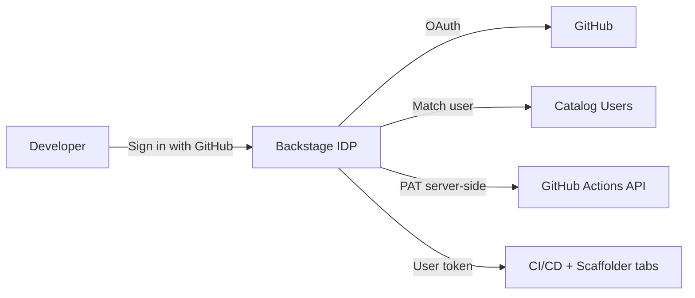

# GitHub Authentication — Company IDP

Production IDP uses **GitHub OAuth** as the primary sign-in method. Guest login is disabled in production.

---

## Architecture



| Layer | Mechanism |
|-------|-----------|
| **Sign-in** | GitHub OAuth (`AUTH_GITHUB_CLIENT_ID` / `SECRET`) |
| **User identity** | Catalog `User` entity matched by GitHub username or email |
| **Server integration** | `GITHUB_TOKEN` (PAT via `IDP_GITHUB_PAT` SST secret) |
| **Production guest** | Disabled |

---

## Step 1 — GitHub OAuth App

GitHub → **Settings** → **Developer settings** → **OAuth Apps** → **New OAuth App**

### Production (AWS ALB / custom domain)

| Field | Value |
|-------|--------|
| Application name | `Company IDP` |
| Homepage URL | `{IDP_PUBLIC_URL}` — e.g. `http://backstageloadba-....elb.amazonaws.com` |
| Authorization callback URL | `{IDP_PUBLIC_URL}/api/auth/github/handler/frame` |

### Local development (optional)

Create a **second** OAuth app or add another callback URL:

| Field | Value |
|-------|--------|
| Homepage URL | `http://localhost:3000` |
| Authorization callback URL | `http://localhost:7007/api/auth/github/handler/frame` |

**Rules**

- No trailing slash on URLs
- Callback must match **exactly** (HTTP vs HTTPS matters)
- After changing `IDP_PUBLIC_URL`, update the OAuth app and redeploy

---

## Step 2 — GitHub repository secrets (IDP repo)

**Randipa/IDP** → Settings → Secrets and variables → Actions

| Secret | Purpose |
|--------|---------|
| `AUTH_GITHUB_CLIENT_ID` | OAuth App Client ID |
| `AUTH_GITHUB_CLIENT_SECRET` | OAuth App Client Secret |
| `IDP_GITHUB_PAT` | Server-side GitHub PAT (scaffolder + integrations) |
| `BACKEND_SECRET` | Backstage backend session signing key |
| `AWS_ROLE_ARN` | IDP deploy role |

---

## Step 3 — Register developers in catalog

Each developer needs a `User` entity in `catalog/org/users.yaml`.

**Option A — GitHub username match (recommended)**

`metadata.name` must equal the GitHub username:

```yaml
---
apiVersion: backstage.io/v1alpha1
kind: User
metadata:
  name: randipa
  annotations:
    github.com/user-login: randipa
spec:
  profile:
    displayName: Randipa
    email: your-github-email@example.com
  memberOf: [platform]
```

**Option B — Email match**

Use the **primary GitHub account email** in `spec.profile.email`.

---

## Step 4 — Deploy IDP

Push changes and run **Deploy Backstage IDP** workflow, or:

```sh
cd idp-infra
export IDP_PUBLIC_URL="http://your-alb-url"
export AUTH_GITHUB_CLIENT_ID="..."
export AUTH_GITHUB_CLIENT_SECRET="..."
npm run deploy:staging
```

---

## Step 5 — Verify

1. Open `{IDP_PUBLIC_URL}` — you should see **Sign in with GitHub** (not auto guest)
2. Click **Sign in with GitHub** → authorize on GitHub
3. If catalog user matches → portal loads
4. Open a component → **GitHub Actions** tab loads without extra popup
5. **Create** → templates visible for signed-in user

---

## Troubleshooting

| Problem | Fix |
|---------|-----|
| `Login failed, popup was closed` | Allow browser popups; click **Sign in** and complete GitHub authorize |
| OAuth redirect error | Callback URL must match `{IDP_PUBLIC_URL}/api/auth/github/handler/frame` exactly |
| Sign-in succeeds then kicked out | Add user to `catalog/org/users.yaml` with matching GitHub username or email |
| CI/CD tab asks login again | Sign in with GitHub first (same session covers GitHub API access) |
| `AUTH_GITHUB_CLIENT_ID` empty | Set secrets in IDP repo and redeploy |
| Scaffolder fails | `IDP_GITHUB_PAT` must be valid with `repo` scope |

---

## Local development

1. Copy `.env.example` → `.env`
2. Set `AUTH_GITHUB_CLIENT_ID`, `AUTH_GITHUB_CLIENT_SECRET`, `GITHUB_TOKEN`
3. Use local OAuth callback on port `7007`
4. Add your GitHub username to `catalog/org/users.yaml`
5. Run `yarn start` → sign in with GitHub (guest still available in development only)

---

## Security notes

- Production: **no guest auth**
- Rotate `BACKEND_SECRET` and PATs periodically
- Prefer HTTPS + custom domain for production OAuth
- Restrict OAuth app to your GitHub organization when possible
