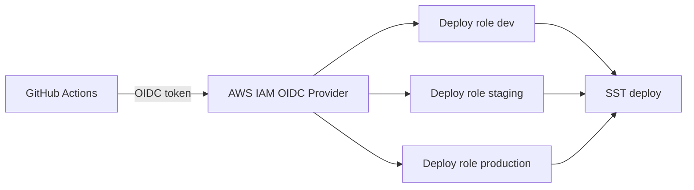

# Phase 2 — GitHub OIDC and AWS Deploy Roles

This guide connects scaffolded repositories to AWS using GitHub OIDC (no long-lived access keys).

## Architecture



## Step 1 — Deploy platform infrastructure

```sh
cd platform-infra
npm install
cp .env.example .env
```

Set values in `.env`:

| Variable | Example |
|----------|---------|
| `GITHUB_ORG` | `your-company` |
| `AWS_REGION` | `ap-south-1` |

Deploy:

```sh
export $(grep -v '^#' .env | xargs)
npm run deploy:platform
```

Save the SST outputs:

- `deployRoleArns.dev`
- `deployRoleArns.staging`
- `deployRoleArns.production`

## Step 2 — Push the IDP repository to GitHub

Reusable workflows live in this repository under `.github/workflows/`:

- `reusable-quality.yml`
- `reusable-security.yml`
- `reusable-deploy-sst.yml`

Scaffolded services call `YOUR_ORG/company-idp/.github/workflows/...`.

Rename the GitHub repository slug if needed, then update template defaults in:

- `catalog/templates/nestjs-api/template.yaml`
- `catalog/templates/nextjs-fullstack/template.yaml`

Look for the `idpRepo` value.

## Step 3 — Configure service repository secrets

For each scaffolded service repository, add:

| Secret | Value |
|--------|-------|
| `AWS_ROLE_ARN` | Role ARN matching the target SST stage |

Recommended: use GitHub Environments (`dev`, `staging`, `production`) with environment-scoped `AWS_ROLE_ARN` values.

## Step 4 — Branch policy

| Branch | SST stage | Trigger |
|--------|-----------|---------|
| `develop` | `dev` | push |
| `main` | `staging` | push |
| manual dispatch | `production` | workflow dispatch |

Create the `main` branch when ready for staging (repos start on `develop`):

```sh
git checkout develop
git checkout -b main
git push -u origin main
```

## Step 5 — Verify

1. Push to `develop` → quality + security + deploy dev
2. Merge to `main` → deploy staging
3. Run workflow dispatch → deploy production

## Troubleshooting

| Issue | Fix |
|-------|-----|
| `Not authorized to perform sts:AssumeRoleWithWebIdentity` | Confirm repo is under the configured `GITHUB_ORG` and OIDC provider exists |
| Reusable workflow not found | Ensure IDP repo is public or accessible to private repos in the org |
| OIDC provider already exists | Import the existing provider or remove duplicate creation in `platform-infra/sst.config.ts` |
| SST permission errors | Start with `AdministratorAccess`, then replace with a custom policy |

## Next phase

Phase 3 adds self-hosted SonarQube and blocks production promotion on quality gate failures.
