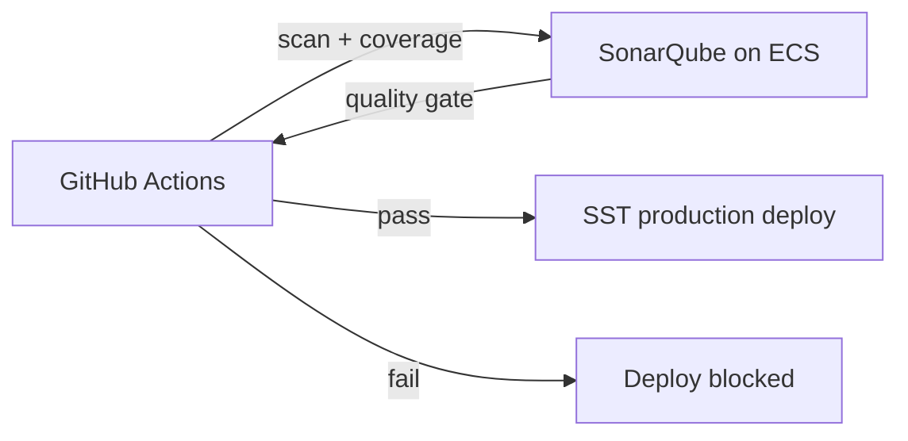

# Phase 3 — Self-Hosted SonarQube and Quality Gates

Deploy SonarQube on AWS and enforce quality gates before production promotion.

## Architecture



## Step 1 — Deploy SonarQube infrastructure

```sh
cd platform-infra
npm install
export AWS_REGION=ap-south-1
npm run deploy:sonarqube
```

SST outputs:

- `sonarUrl` — SonarQube web UI (port 80 via load balancer)

Stack contents:

- VPC with managed NAT
- RDS PostgreSQL (`t4g.micro`)
- ECS Fargate service running `sonarqube:lts-community`

First boot can take several minutes while SonarQube initializes.

## Step 2 — Initial SonarQube setup

1. Open `sonarUrl` in a browser
2. Sign in with default credentials `admin` / `admin`
3. Change the admin password immediately
4. Create a quality gate (or customize **Sonar way**):
   - 0 new blocker/critical issues on new code
   - Minimum coverage on new code (recommended: 80%)
5. Create a group `ci-analysis` and a token for GitHub Actions

## Step 3 — Configure GitHub secrets

Set organization or repository secrets used by scaffolded services:

| Secret | Example |
|--------|---------|
| `SONAR_HOST_URL` | `http://company-idp-sonarqube-....elb.amazonaws.com` |
| `SONAR_TOKEN` | SonarQube user token with **Execute Analysis** permission |

## Step 4 — CI behaviour

| Event | SonarQube scan | Quality gate blocks deploy |
|-------|----------------|----------------------------|
| Pull request | Yes | No |
| Push to `develop` | Yes | No (dev deploy skips SonarQube requirement) |
| Push to `main` | Yes | No (staging deploy runs after scan completes) |
| Manual production deploy | Yes | **Yes** — production blocked on gate failure |

Reusable workflow: `.github/workflows/reusable-sonarqube.yml`

## Step 5 — Project configuration

Scaffolded services include `sonar-project.properties` with:

- project key = service name
- LCOV coverage path
- `sonar.qualitygate.wait=true`

Ensure the SonarQube project exists (auto-created on first scan) and is assigned to your quality gate.

## Recommended quality gate (production)

| Condition | Threshold |
|-----------|-----------|
| New reliability rating | A |
| New security rating | A |
| New maintainability rating | A |
| New coverage | ≥ 80% |
| New duplicated lines | ≤ 3% |

## Troubleshooting

| Issue | Fix |
|-------|-----|
| SonarQube UI not loading | Wait for ECS health check; verify security groups allow HTTP to the load balancer |
| `SONAR_HOST_URL` unreachable from GitHub | SonarQube must be reachable from the public internet or use self-hosted GitHub runners in the VPC |
| Quality gate always fails | Lower thresholds initially, then tighten; confirm `coverage/lcov.info` is generated |
| ECS task OOM | Increase service memory in `platform-infra/lib/sonarqube-stack.ts` |

## Next phase

Phase 4 adds Backstage plugins to surface GitHub, AWS, and SonarQube status inside the developer portal.
