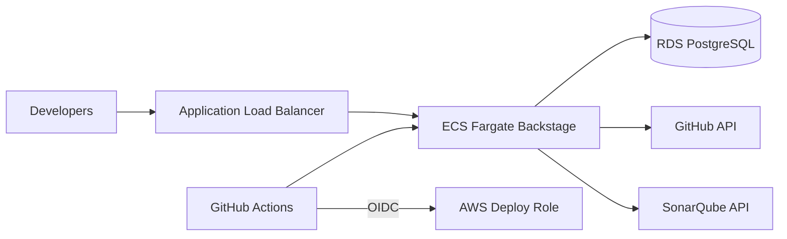

# Phase 5 — Deploy Backstage IDP to AWS

Runbook for hosting the developer portal on ECS with RDS PostgreSQL via SST.

## Architecture



Stack location: [`idp-infra/`](../idp-infra/)

## Step 1 — Prerequisites

Complete earlier phases:

- Platform IAM roles (`platform-infra`)
- SonarQube deployed (`platform-infra` stage `sonarqube`)
- IDP repository on GitHub

## Step 2 — DNS and public URL

Choose the final URL, e.g. `https://idp.company.com`.

Set GitHub repository variable:

| Variable | Example |
|----------|---------|
| `IDP_PUBLIC_URL` | `https://idp.company.com` |
| `AWS_REGION` | `ap-south-1` |
| `SONARQUBE_BASE_URL` | SonarQube internal/backend URL |
| `SONARQUBE_EXTERNAL_URL` | SonarQube browser URL |

For the first deploy you can temporarily use the load balancer URL from SST output, then update DNS and redeploy with the final URL.

## Step 3 — GitHub OAuth app

Create a GitHub OAuth application:

| Field | Value |
|-------|-------|
| Homepage URL | `IDP_PUBLIC_URL` |
| Callback URL | `{IDP_PUBLIC_URL}/api/auth/github/handler/frame` |

Add repository secrets:

| Secret | Purpose |
|--------|---------|
| `AUTH_GITHUB_CLIENT_ID` | OAuth client ID |
| `AUTH_GITHUB_CLIENT_SECRET` | OAuth client secret |
| `AWS_ROLE_ARN` | Deploy role (staging/production) |

## Step 4 — SST secrets (one time per stage)

```sh
cd idp-infra
npm install

npx sst secret set GithubToken "ghp_..." --stage staging
npx sst secret set SonarApiKey "..." --stage staging
npx sst secret set BackendSecret "$(openssl rand -hex 32)" --stage staging
```

## Step 5 — Deploy

### From CI (recommended)

Run **Deploy Backstage IDP** workflow in GitHub Actions, or push to `main`.

### Locally

```sh
cd idp-infra
cp .env.example .env
export $(grep -v '^#' .env | xargs)
chmod +x scripts/prepare-deploy.sh
npm run deploy:staging
```

## Step 6 — Verify

1. Open `IDP_PUBLIC_URL`
2. Sign in with GitHub
3. Open **Create** → confirm templates appear
4. Open a catalog entity → CI/CD, Code Quality, AWS tabs load

## Stage mapping

| IDP SST stage | Recommended use |
|---------------|-----------------|
| `dev` | Platform team experiments |
| `staging` | Pre-production portal |
| `production` | Company-wide IDP |

## Troubleshooting

| Issue | Fix |
|-------|-----|
| Docker build fails | Run `yarn build:backend` before deploy; ensure Docker BuildKit enabled |
| Health check failing | Confirm `/healthcheck` on port 7007; check ECS logs |
| Database connection errors | Verify RDS security groups allow ECS tasks; check `POSTGRES_*` env vars |
| GitHub login fails | Confirm OAuth callback URL matches `IDP_PUBLIC_URL` exactly |
| Catalog empty | Ensure `catalog/` is copied in Docker image (see `packages/backend/Dockerfile`) |

## Hardening checklist

- [ ] HTTPS via ACM certificate on the load balancer
- [ ] Replace guest auth (local only) with GitHub OAuth in production
- [ ] Restrict GitHub deploy IAM roles per repository
- [ ] Enable RDS backups and monitoring
- [ ] Store SST secrets only in AWS, rotate regularly

## Company IDP — complete

With Phase 5, the platform includes:

- Backstage portal on AWS
- Software templates (NestJS, Next.js)
- GitHub OIDC deploy pipeline
- SonarQube quality gates
- Entity plugins for GitHub, SonarQube, and AWS
